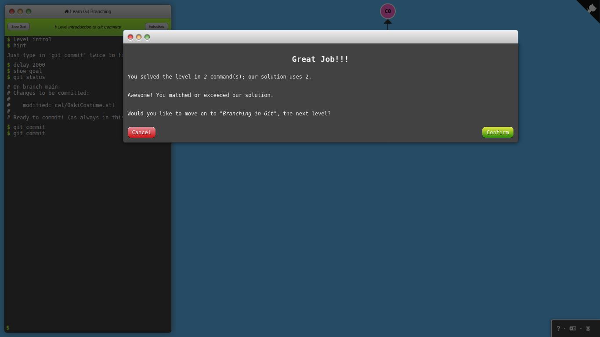
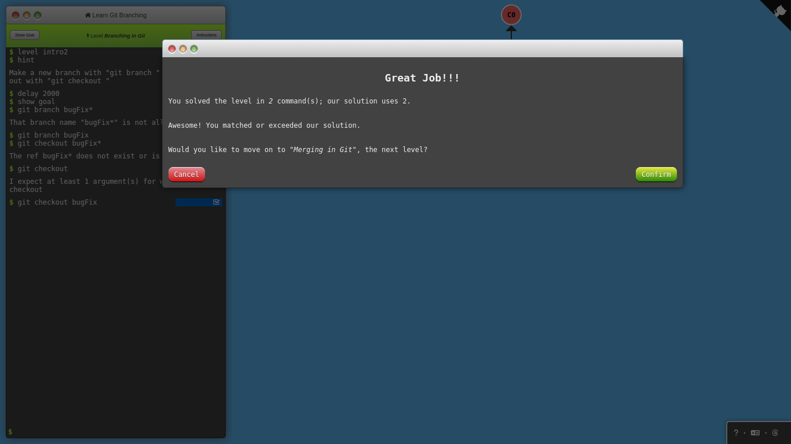
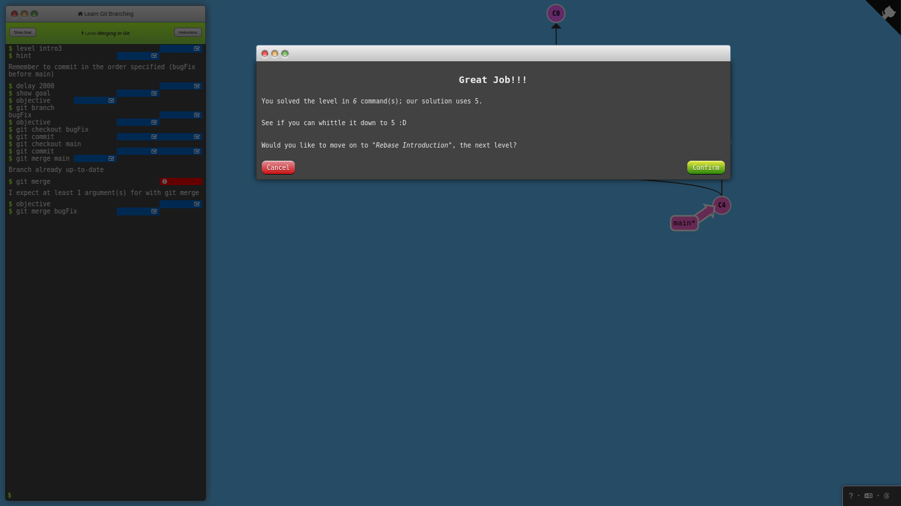
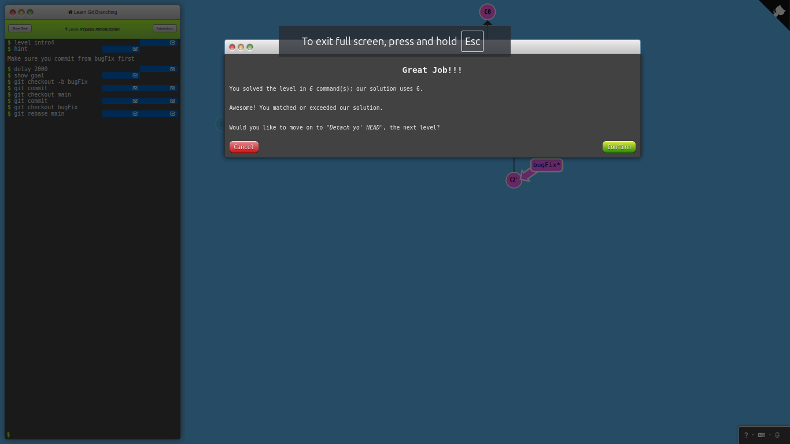
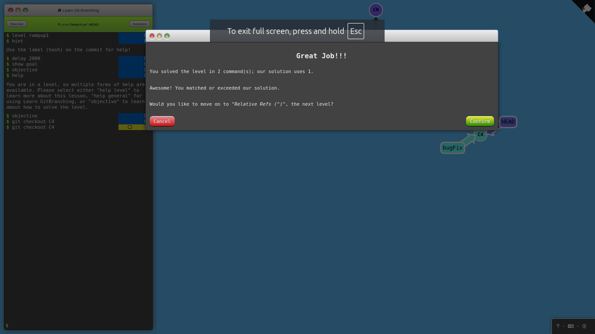
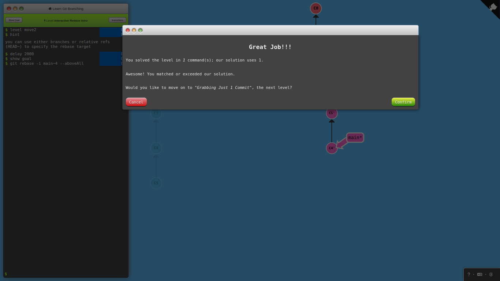
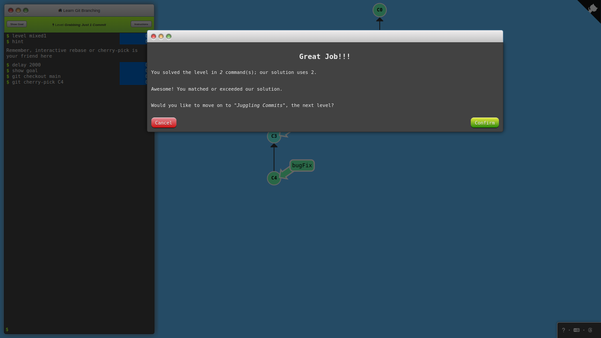

# Git_Branching

 

## 1.1 Introduction to Git Commits

## 1.2 Branching in Git

 

## 1.3 Merging in Git

## Rebase Introduction

 

## 2.1 Detach yo' HEAD

## 2.2 Relative Refs (^)

## 2.3 Relative Refs #2(~)

## 2.4 Reversing Change in git

 

## 3.1 Cherry-pick Intro

## 3.2 Interactive Rebase Intro

 

## 4.1 Brabbing Just 1 Commit

