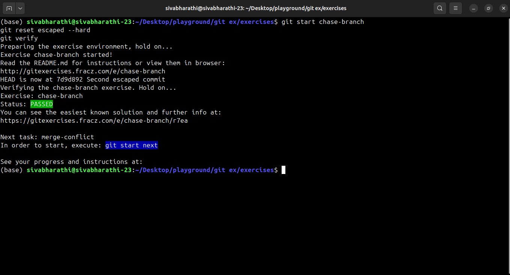
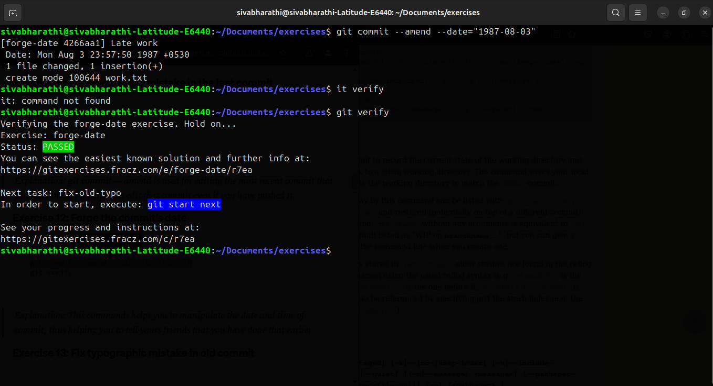

# Git Exercise

## Commit-one-file

## Commit-one-file-staged

## Ignore them

## Chase-branch

## Merge-confilt

![05] (image-4.png)

## Save-your-work  
!
      
## Change-branch-history  
     

## Remove-ignored   
 

## Case-sensitive-filename   

## Fix-typo  
       

## Forge-date
    

## Fix-old-typo  

## Commit-lost  
   

## Split-commit
    

## Too-many-commits  
 

## Executable     

## Commit-parts  
 

## pick-your-features    

## Rebase-complex
 

## Invalid-order
     

## Find-swearwords  

## Find-bug  

# Complete the git exercises task
